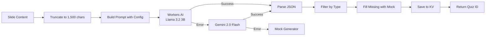

# GenQ — AI Quiz Generator
## เปลี่ยนสไลด์เรียน เป็นข้อสอบฝึกฝนใน 1 นาที

---

## 👤 จัดทำโดย
- **ชื่อ:** นายณัฐดนัย สิงห์งาม
- **ตำแหน่ง:** นักพัฒนา Full-Stack
- **เทคโนโลยี:** Cloudflare Workers · React · AI

---

# 📌 ปัญหา (Problem)

### การอ่านสไลด์เรียนอย่างเดียวไม่เพียงพอ
- นักเรียน **อ่านอย่างเดียว → ลืมเร็ว**
- การทำข้อสอบช่วย **กระตุ้นความจำ (Active Recall)**
- แต่การทำข้อสอบเองต้องใช้เวลา **เตรียมคำถามนาน**

### โจทย์
> "จะเปลี่ยนสไลด์เรียนเป็นข้อสอบแบบอัตโนมัติได้อย่างไร
> โดยที่ไม่ต้องเสียเวลาเตรียมคำถาม?"

---

# 💡 แนวคิด (Solution)

### GenQ = Generator + Quiz

| ก่อน | หลัง |
|------|------|
| ❌ อ่านสไลด์อย่างเดียว | ✅ อ่าน → ทำข้อสอบ → รู้ผลทันที |
| ❌ เตรียมข้อสอบเองใช้เวลานาน | ✅ AI สร้างให้อัตโนมัติใน 1 นาที |
| ❌ ทำแค่ครั้งเดียว | ✅ ทำซ้ำหลายรอบได้ ไม่ซ้ำคำถามเดิม |
| ❌ ดูเฉลยไม่ได้จนกว่าจะส่ง | ✅ ดูเฉลยละเอียด + คำอธิบายทุกข้อ |

---

# ✨ ความสามารถ (Features)

### 📤 อัปโหลดสไลด์
- รองรับ **PDF · PPTX · DOCX · TXT**
- สูงสุด **15MB** (Cloudflare Free Plan)
- อัปโหลดซ้ำได้หลายรอบ → คำถามไม่ซ้ำ

### 🧠 สร้างข้อสอบด้วย AI
- **Multiple Choice** (เลือกตอบ 4 ตัวเลือก)
- **True-False** (ถูก-ผิด)
- **Short Answer** (ตอบสั้น)
- **Completion** (เติมคำในช่องว่าง)
- **Matching** (จับคู่ซ้าย-ขวา)

### ⚙️ ปรับแต่งได้
- เลือกประเภทข้อสอบที่ต้องการ
- กำหนดจำนวนแต่ละประเภท (รวมสูงสุด 40 ข้อ)
- AI กระจายข้อถูกแบบสุ่ม ไม่ซ้ำ A ทุกข้อ

---

# 🎮 โหมดการใช้งาน

### 📖 โหมดทำข้อสอบ (Take Mode)
- ทำข้อสอบทีละข้อแบบ Flashcard
- กดเลือกคำตอบ → รู้ผลทันที (เขียว/แดง)
- มีคำอธิบายประกอบทุกข้อ
- Timer 30 นาที (นับถอยหลัง)

### ✅ โหมดดูเฉลย (View Mode)
- ดูข้อสอบทั้งหมดพร้อมเฉลย
- แสดง/ซ่อนเฉลยทีละข้อได้
- แสดงคำอธิบายเหตุผลทุกข้อ
- พิมพ์ข้อสอบ + เฉลย (Print)

### 📊 หน้า Results
- Score Ring แบบ Donut Chart
- เกรด A-B-C-D-F
- ดูข้อที่ถูก/ผิด พร้อมคำอธิบาย
- จุดอ่อนที่ควรกลับไปทบทวน
- ทำข้อสอบอีกครั้ง (Reattempt)

---

# 🧱 เทคโนโลยีที่ใช้ (Tech Stack)

### Frontend
| เทคโนโลยี | การใช้งาน |
|-----------|-----------|
| **React 18** | UI Framework |
| **Vite** | Build Tool |
| **React Router v6** | SPA Routing |
| **Tailwind CSS 3** | Styling |
| **Framer Motion** | Animations |
| **Lucide React** | Icons |
| **React Dropzone** | File Upload |

### Backend / Infrastructure (Cloudflare)
| เทคโนโลยี | การใช้งาน |
|-----------|-----------|
| **Cloudflare Workers** | Serverless API (Hono) |
| **Cloudflare Pages** | Static Hosting + Auto-deploy |
| **Cloudflare KV** | Quiz Data Storage |
| **Cloudflare D1** | SQLite (future) |
| **Workers AI** | AI Quiz Generation |

---

# 🏗 สถาปัตยกรรม (Architecture)

```
┌─────────────┐    ┌──────────────────┐    ┌──────────────┐
│   Browser    │───▶│  Cloudflare      │───▶│  Workers AI  │
│  (React SPA) │    │  Worker (API)    │    │  Llama 3.2   │
└─────────────┘    └──────┬───────────┘    └──────────────┘
                          │                        │
                          ▼                        ▼
                   ┌──────────────┐       ┌──────────────┐
                   │  KV (Quiz)   │       │  Fallback:   │
                   │  D1 (Future) │       │  Gemini/Mock │
                   └──────────────┘       └──────────────┘
```

### AI Flow
> **Workers AI** (primary, 10k req/day ฟรี)
> → **Gemini 2.0 Flash** (fallback, ต้องมี API key)
> → **Mock Generator** (last resort, ข้อสอบ built-in)

### Deploy Flow
> **git push** → GitHub → Cloudflare Pages Auto-deploy
> **wrangler deploy** → Cloudflare Worker

---

# 📊 Model AI Pipeline



---

# 📈 การทำซ้ำและความสดของข้อสอบ (Freshness)

### รอบที่ N (Round Tracking)
- เมื่ออัปโหลดไฟล์เดิมซ้ำ → นับรอบจาก History
- AI Prompt ส่ง `round` Number → กำชับไม่ให้ซ้ำคำถามเดิม

### Freshness Logic
```
Round 0: AI สร้างอิสระ
Round 1+: AI ถูกสั่ง "อย่าซ้ำรอบก่อนหน้า"
          สูงสุด 5 ข้อซ้ำจาก 25 ข้อ
```

### Mock Fill
- ถ้า AI สร้างไม่ครบตามจำนวน → Mock Generator เติมให้
- Mock ใช้ hash-based seed จากชื่อไฟล์ → ข้อสอบหลากหลายตามเนื้อหา

---

# 🎨 UI/UX

### Dark Mode First
- พื้นหลัง `#0F172A` · Surface `#1E293B` · Accent `#6366F1`
- ฟอนต์ Kanit (ไทย) + Inter (อังกฤษ)
- CSS Custom Properties → รองรับ Light/Dark Mode Toggle

### Gamified Experience
- Flashcard-style (ทีละข้อ โฟกัสเต็มที่)
- Instant Feedback (กดตอบ → เปลี่ยนสีทันที)
- Score Ring Animation
- เกรด A-F + คำแนะนำจุดอ่อน

---

# 🔐 ความปลอดภัย

### Google OAuth Login
- OAuth 2.0 ผ่าน Google
- JWT Token ใน localStorage
- แยก session สำหรับ user ที่ login vs guest

### Guest Mode (ไม่ต้อง Login)
- History เก็บใน **sessionStorage** (หายเมื่อปิด Tab)
- ลบประวัติได้ทั้งหมดหรือทีละรายการ
- สร้างข้อสอบได้ไม่จำกัด

---

# 🚀 Deploy Pipeline

### Frontend Auto-deploy
```bash
git push origin main
# → GitHub Actions → Cloudflare Pages
# → https://genq-dlg.pages.dev
```

### Backend Manual Deploy
```bash
wrangler deploy src/index.js --name=genq-api
# → https://genq-api.banana-by-monky.workers.dev
```

### Deployment Note
- Cloudflare API Token ต้องตั้งผ่าน Python `os.environ`
- (shell expansion ทำให้ Token เสียหาย)
- Frontend + Backend deploy แยกกัน

---

# ✅ สิ่งที่ทำสำเร็จแล้ว

### Core Features
- ✅ อัปโหลด PDF/PPTX/DOCX/TXT (สูงสุด 15MB)
- ✅ AI สร้างข้อสอบ 5 ประเภท
- ✅ ปรับแต่งจำนวนข้อสอบ (สูงสุด 40 ข้อ, ต่อประเภทไม่จำกัด)
- ✅ ทำข้อสอบ + Instant Feedback
- ✅ ดูเฉลยละเอียด + คำอธิบาย
- ✅ Print ข้อสอบ
- ✅ Score Chart + เกรด
- ✅ Timer 30 นาที
- ✅ ทำซ้ำได้หลายรอบ
- ✅ History + Folder Grouping
- ✅ ลบประวัติ (ทีละรายการ/ทั้งหมด/ทั้งโฟลเดอร์)
- ✅ Google OAuth Login
- ✅ สลับ Light/Dark Mode
- ✅ AI Fallback Chain
- ✅ CorrectIndex Randomization

---

# 🔮 แผนพัฒนาในอนาคต (Roadmap)

### เร็วๆ นี้
- [ ] **Auto-submit** เมื่อ Timer หมด
- [ ] **Export** ข้อสอบเป็น PDF
- [ ] **Dashboard** สถิติการทำข้อสอบรายบุคคล
- [ ] **AI Summary** สรุปเนื้อหาจากสไลด์

### ระยะกลาง
- [ ] **Leaderboard** สำหรับการแข่งขัน
- [ ] **Share Quiz** แชร์ข้อสอบให้เพื่อน
- [ ] **Question Bank** รวมคำถามจากหลายแหล่ง
- [ ] **D1 Database** สำหรับ query ที่ซับซ้อน

### ระยะยาว
- [ ] **Adaptive Quiz** AI ปรับระดับความยากตามผู้ใช้
- [ ] **Spaced Repetition** ทวนคำถามตามช่วงเวลา
- [ ] **Multi-language** รองรับหลายภาษา
- [ ] **Mobile App** (React Native)

---

# 📊 สถิติโครงการ

| รายการ | ข้อมูล |
|--------|--------|
| **ภาษาโปรแกรม** | JavaScript (TypeScript-ready) |
| **Framework Frontend** | React 18 + Vite |
| **Framework Backend** | Hono (Cloudflare Workers) |
| **AI Model หลัก** | Llama 3.2 3B (Workers AI) |
| **Lines of Code** | ~3,000+ |
| **Deployment** | Cloudflare (Free Tier) |
| **Domain** | genq-dlg.pages.dev |
| **Repository** | github.com/NatdanaiSingngam/GenQ |

---

# 🙏 ขอบคุณครับ

### ลองใช้ GenQ ได้ที่
[https://genq-dlg.pages.dev](https://genq-dlg.pages.dev)

### Source Code
[https://github.com/NatdanaiSingngam/GenQ](https://github.com/NatdanaiSingngam/GenQ)

---

**GenQ — AI Quiz Generator**
*เปลี่ยนสไลด์เรียน เป็นข้อสอบฝึกฝนใน 1 นาที*
